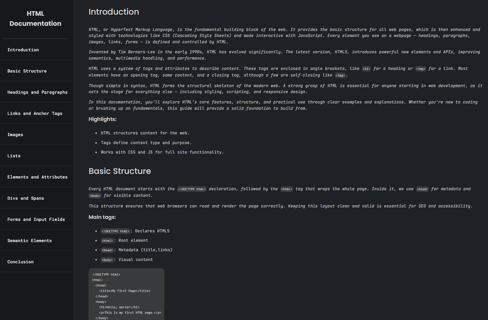

# HTML Documentation Page

A modern, responsive, and user-friendly documentation page about the **HTML language**, built with **HTML** and **CSS**. This project focuses on clear content presentation, intuitive navigation, and adaptive design for all devices.

## Features

- **Responsive Design:** Optimized for mobile, tablet, and desktop viewing.
- **Modern UI:** Clean layout with readable typography and well-organized sections.
- **User-Friendly:** Easy to navigate and understand, making learning HTML straightforward.
- **Custom CSS Styling:** Uses `styles.css` for layout, colors, and interactive effects.
- **Semantic HTML:** Structured with best HTML practices for accessibility and SEO.

## Preview

## Demo

Check out the live demo here:  
[https://saikat-codes.github.io/documentation-page/](https://saikat-codes.github.io/documentation-page/)

## Getting Started

1. **Clone the repository:**

 git clone https://github.com/saikat-codes/documentation-page.git

2. **Open `index.html` in your browser** to view the documentation.
3. **Customize** the content or styles in `index.html` and `styles.css` as needed.

## Technologies Used

- **HTML5** (`index.html`)
- **CSS3** (`styles.css`)

## Folder Structure

/project-root
├── index.html
├── styles.css
└── README.md

## Customization

- Update or expand the HTML documentation content in `index.html`.
- Modify the design, colors, and layout in `styles.css` to fit your preferences.

## Credits

Created by [Your Name](https://github.com/saikat-codes).

---

Feel free to use or adapt this project as a learning resource or template for your own documentation pages!
